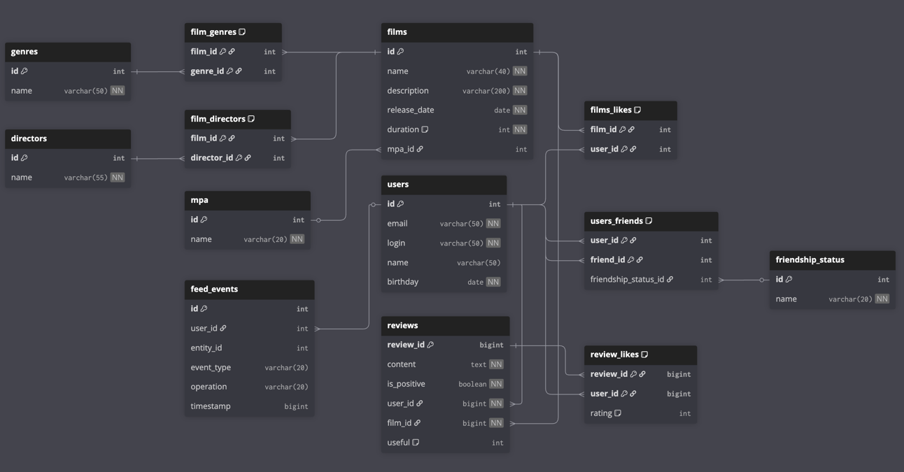

# Java-Filmorate
Template repository for Filmorate project.

### ER-диаграмма базы данных Filmorate


## Описание схемы базы данных Filmorate

Данная схема описывает структуру базы данных проекта **Filmorate** — сервиса для оценки фильмов,
добавления друзей и формирования рейтингов по лайкам пользователей.

База данных реализует связи между пользователями, фильмами, жанрами и возрастными рейтингами (MPA),
а также хранит информацию о дружбе и статусах отношений между пользователями.

---

### Основные таблицы

#### **`films`** — хранит основную информацию о фильмах:  
- `film_id` — первичный ключ  
- `name`, `description`, `releaseDate`, `duration` — характеристики фильма  
- `mpa_id` — ссылка на возрастной рейтинг (таблица `MPA`)

#### **`users`** — содержит данные о пользователях:  
- `user_id` — первичный ключ  
- `email`, `login`, `name`, `birthday` — регистрационные данные пользователя

#### **`reviews`** — хранит основную информацию об отзывах пользователей:
-  `review_id` — первичный ключ  
-  `content` — текст отзыва  
- `is_positive` — является ли отзыв положительным?
- `user_id`, `film_id` — идентификаторы пользователя, который пишет комментарий и фильма на который оставляется отзыв
- `useful` — шакала оценки отзыва

#### **`review_likes`** — лайки пользователей на отзыв
#### **`genres`** — справочник жанров фильмов  
#### **`mpa`** — справочник возрастных рейтингов
#### **`directors`** — справочник режиссёров

---

### Таблицы связей (многие ко многим)

#### **`films_genres`** — связывает фильмы и жанры  
- Составной ключ `(film_id, genre_id)` обеспечивает уникальность пары

#### **`films_likes`** — хранит информацию о лайках фильмов пользователями  
- Составной ключ `(film_id, user_id)` предотвращает повторный лайк одного фильма одним пользователем  

#### **`films_directors`** — связывает режиссера и фильм
- Составной ключ `(film_id, director_id)` обеспечивает уникальность пары

---

### Друзья и статусы

#### **`users_friends`** — хранит связи между пользователями (дружбу)  
- Составной ключ `(user_id, friend_id)`  
- `friendship_status_id` указывает на статус дружбы (например: «ожидание», «подтверждено»)

#### **`friendship_status`** — справочник статусов дружбы

---

## Основные SQL-запросы проекта Filmorate

Ниже приведены основные SQL-запросы для работы с таблицами `users`, `users_friends`, `films` и `films_likes`.  
Каждый запрос снабжён пояснением, что он делает.

---

## Пользователи

### 1. Получить всех пользователей

```sql
SELECT *
FROM users;
```
Выводит все строки из таблицы users.

Поля: user_id, email, login, name, birthday.

### 2. Получить пользователя по ID

```sql
Копировать код
SELECT *
FROM users
WHERE user_id = {id};
Возвращает одного пользователя с указанным user_id.
```
{id} нужно заменить на конкретное число или параметр.

### 3. Получить друзей пользователя

```sql
Копировать код
SELECT *
FROM users
WHERE user_id IN (
    SELECT friend_id
    FROM users_friends
    WHERE user_id = {id}
);
```
Внутренний подзапрос получает список ID друзей пользователя {id}.

Внешний запрос возвращает полные данные этих друзей.

### 4. Получить общих друзей двух пользователей

```sql
Копировать код
SELECT *
FROM users
WHERE user_id IN (
    SELECT friend_id
    FROM users_friends
    WHERE user_id = {id}
      AND friend_id IN (
          SELECT friend_id
          FROM users_friends
          WHERE user_id = {other_id}
      )
);
```

Возвращает пользователей, которые являются друзьями одновременно у {id} и {other_id}.

Использует вложенные подзапросы для пересечения списков друзей.

 ## Фильмы

### 1. Получить все фильмы

```sql
SELECT *
FROM films;
```

Выводит все фильмы с полями: film_id, name, description, releaseDate, duration, mpa_id.

### 2. Получить фильм по ID

```sql
SELECT *
FROM films
WHERE film_id = {id};
```

Возвращает один фильм с указанным film_id.

### 3. Получить топ фильмов по количеству лайков

```sql
SELECT f.*,
       COUNT(fl.user_id) AS rating
FROM films AS f
LEFT JOIN films_likes AS fl ON f.film_id = fl.film_id
GROUP BY f.film_id
ORDER BY rating DESC
LIMIT {count};
```

LEFT JOIN соединяет фильмы с лайками, чтобы учитывать фильмы без лайков.

COUNT(fl.user_id) AS rating — подсчитывает количество лайков каждого фильма.

GROUP BY f.film_id — группировка по фильму.

ORDER BY rating DESC — сортировка по убыванию лайков.

LIMIT {count} — возвращает только первые {count} фильмов.
